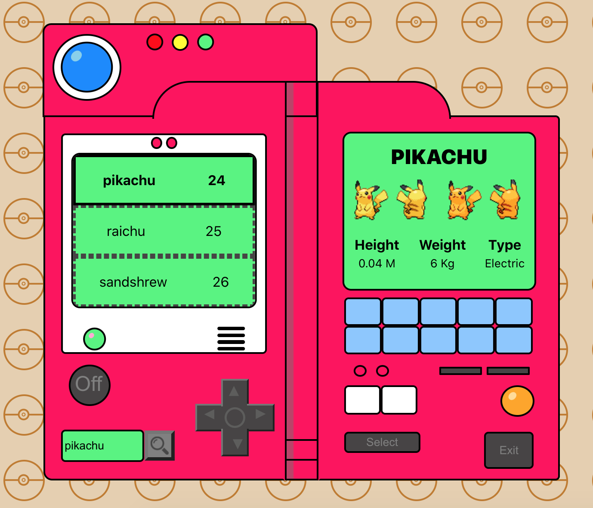

# S9.Final

Triar la temàtica del projecte, així com els passos per a dur-lo a terme. Només s'especifica una sèrie de requisits mínims a complir.

### Requisits mínims

- Crear almenys 5 components.
- Usar input i output per a passar dades entre components.
- Fer servir les rutes.
- Utilitzar Redux o Context.
- Cridar mínim a una API externa.
- Fer servir serveis per a implementar lògica de negoci i/o anomenades API.
- Implementar login/registre, idealment amb Firebase, encara que ho pots fer amb localStorage.
- Protegir les rutes, bé perquè hi hagi un usuari administrador que pot només veure ell una part, o perquè hi hagi usuaris normals i premium.
- La solució ha d'estar ben maquetada i ser responsive.

## En Contrucción:

